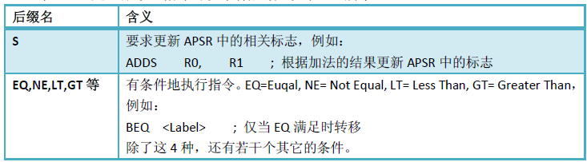

## Reference

- 《Cortex-M3权威指南》
- 《ARMv7-M Architecture Reference Manual》
- 《Cortex-M3 Technical Reference Manual》

## Chapter1 介绍

Cortex－M3处理器（CM3）采用ARMv7-M架构，它包括**所有的**16位Thumb指令集和**基本的**32位Thumb-2指令集架构，Cortex-M3处理器**不能**执行ARM指令集。

CM3的出现，还在ARM处理器中破天荒地支持了“非对齐数据访问支持”。

## Chapter2 CM3概览

### 2.2 Registers

CM3有R0-R15，16个registers。R13作为堆栈指针SP。SP有两个，但在同一时刻只能有一个可以看到，这也就是所谓的“banked”寄存器。


绝大多数16位Thumb指令只能访问R0-R7，而32位Thumb-2指令可以访问所有寄存器。

Cortex-M3拥有两个堆栈指针，然而它们是banked，因此任一时刻只能使用其中的一个。

- 主堆栈指针（MSP）：复位后缺省使用的堆栈指针，用于操作系统内核以及异常处理例程（包括中断服务例程）
- 进程堆栈指针（PSP）：由用户的应用程序代码使用。

R14 LR：当调用一个子程序时，由R14存储返回地址。

R15 PC: 指向当前的程序地址。如果修改它的值，就能改变程序的执行流。

### 2.3 操作模式和特权级别

两种操作模式：handler mode（异常服务程序代码），thread mode（应用程序代码）。

两种特权级别：特权级，用户级。


在CM3运行主应用程序时（线程模式），既可以使用特权级，也可以使用用户级；但是异常服务例程必须在特权级下执行。复位后，处理器默认进入线程模式，特权极访问。


用户级的程序不能简简单单地试图改写CONTROL寄存器就回到特权级，它必须先“申诉”：执行一条系统调用指令(SVC)。这会触发SVC异常，然后由异常服务例程（通常是操作系统的一部分）接管，如果批准了进入，则异常服务例程修改CONTROL寄存器，才能在用户级的线程模式下重新进入特权级。

### 2.5 存储器映射

总体来说，Cortex-M3支持4GB存储空间，如图2.6所示地被划分成若干区域。


从图中可见，不像其它的ARM架构，它们的存储器映射由半导体厂家说了算，Cortex-M3预先定义好了“粗线条的”存储器映射。

### 2.6 总线接口

### 2.9 中断和异常

11种系统异常+5个保留档位+240个外部中断。
| 编号  | 类型  |优先级 |简介|
|---|---|---|---|
| 0  | N/A  | N/A |没有异常在运行|
| 1  | 复位  | -3（最高） |复位|
| 2  | NMI  | -2 |不可屏蔽中断（来自外部NMI输入脚）|
| 3  | 硬(hard) fault  | -1 |所有被disable的fault，都将“上访”成硬fault|
| 4  | MemManage fault  | 可编程 |存储器管理fault，MPU访问犯规以及访问非法位置|
| 5  | 总线fault  | 可编程 |总线错误（预取流产（Abort）或数据流产）|
| 6  | 用法(usage)Fault  | 可编程 |由于程序错误导致的异常|
| 7-10  | 保留  | N/A |N/A|
| 11  | SVCall  | 可编程 |系统服务调用|
| 12  | 调试监视器  | 可编程 |调试监视器（断点，数据观察点，或者是外部调试请求|
| 13  | 保留  | N/A |N/A|
| 14  | PendSV  | 可编程 |为系统设备而设的“可悬挂请求”（pendable request）|
| 15  | SysTick  | 可编程 |系统滴答定时器|
| 16-255  | IRQ #0~239  | 可编程 |外中断#0~#239|

### 2.10 调试支持

Cortex-M3的调试系统基于ARM最新的CoreSight架构。不同于以往的ARM处理器，内核本身不再含有JTAG接口。取而代之的，是CPU提供称为“调试访问接口(DAP)”的总线接口。

目前可用的DPs包括**SWJ-DP**(既支持传统的JTAG调试，也支持新的串行线调试协议SWD)，另一个**SW-DP**则去掉了对JTAG的支持。另外，也可以使用ARM CoreSignt产品家族的**JTAG-DP**模块。这下就有3个DPs可以选了，芯片制造商可以从中选择一个，以提供具体的调试接口（通常都是选SWJ-DP）。

## Chpater3 CM3基础

PC: 读PC时返回的值是当前指令的地址+4。在分支时，无论是直接写PC的值还是使用分支指令，都必须保证加载到PC的数值是奇数（即LSB=1），用以表明这是在Thumb状态下执行。
> 可以在map文件中看到thumb code的地址lsb都是奇数。data地址不受影响。

### 3.2 特殊功能寄存器

Cortex-M3还在内核水平上搭载了若干特殊功能寄存器，包括


它们只能被专用的MSR/MRS指令访问

```asm
MRS <gp_reg>, <special_reg>; 读特殊功能寄存器的值到通用寄存器
MSR <special_reg>, <gp_reg> ;写通用寄存器的值到特殊功能寄存器
```

#### 3.2.1 程序状态寄存器

- 应用程序PSR（APSR）
- 中断号PSR（IPSR）
- 执行PSR（EPSR）

通过MRS/MSR指令，这3个PSRs即可以单独访问，也可以组合访问（2个组合，3个组合都可以）。当使用三合一的方式访问时，应使用名字“xPSR”或者“PSR”。


APSR:

- N: 负数标志
- Z: 0结果标志
- C: 进位/错位标志
- V: 溢出标志

#### 3.2.2 中断屏蔽寄存器

- PRIMASK - 这是个只有1 bit的寄存器。在它被置1后，就关掉所有可屏蔽的异常，只剩下NMI和Hardfault可以响应。
- FAULTMASK - 这是个只有1 bit的寄存器。当它置1时，只有NMI才能响应，所有其它的异常，甚至是Hardfault，也不能响应。
- BASEPRI - 这个寄存器最多有9位（由表达优先级的位数决定）。它定义了被屏蔽优先级的阈值。当它被设成某个值后，所有优先级号大于等于此值的中断都被关（优先级号越大，优先级越低）。

要访问PRIMASK, FAULTMASK以及BASEPRI，同样要使用MRS/MSR指令。

#### 3.2.3 控制寄存器

控制寄存器有两个用途，其一用于定义特权级别，其二用于选择当前使用哪个堆栈指针。
CONTROL[1]：0=选择主堆栈指针MSP（复位后的缺省值），1=选择进程堆栈指针PSP。
CONTROL[0]：0=特权级的线程模式，1=用户级的线程模式。

## Chapter4 指令集

**EQU**：定义常数，常数定义必须顶格写。
`Stack_Size      EQU     0x00006000`
DCB：定义一串字节常数。
DCD：定义一串23位整数。

```asm
MY_NUMBER
    DCD 0x12345678
HELLO_TEXT
    DCB ”Hello\n”,0
```

### 4.1 后缀的使用



### 4.2 指令集

详细指令见附录。

## Chapter5 存储器系统

### 5.2 存储器映射

### 5.3 存储器的各种访问属性

1. 代码区（0x0000_0000- 0x1FFF_FFFF）。该区是可以执行指令的，缓存属性为Write Through。在此区上的数据操作是通过D-Code?(**此处存疑**)，且在此区上的写操作是缓冲的。
2. SRAM区（0x2000_0000 – 0x3FFF_FFFF）。此区用于片内SRAM，写操作是缓冲的write back/write allocated，此区亦可以执行指令。
3. 片上外设区(0x4000_0000 – 0x5FFF_FFFF)。该区用于片上外设，因此是不可缓存的，也不可以在此区执行指令。

### 5.4 存储器的缺省访问许可

### 5.5 位带操作

### 5.6 非对齐数据传送

### 5.7 互斥访问

### 5.8 端模式

## Chapter 6 Cortex-M3 全貌

### 6.3 CM3的总线接口

CM3采用了哈佛结构，拥有独立的指令总线和数据总线，可以让取指与数据访问并行不悖。


#### 6.3.1 I-Code 总线

I-Code的作用是取指令&执行指令，只和指令有关，I-Code 总线是一条基于 AHB-Lite 总线协议的 32 位总线，负责在 0x0000_0000 – 0x1FFF_FFFF 之间的取指操作。
> 从flash取指令

#### 6.3.2 D-Code 总线

D-Code 的作用是对数据读写访问，只和数据有关，D-Code 总线也是一条基于 AHB-Lite 总线协议的 32 位总线，负责在 0x0000_0000 – 0x1FFF_FFFF（与I-Code相同）之间的数据访问操作。尽管 CM3 支持非对齐访问，但你绝不会在该总线上看到任何非对齐的地址，这是因为处理器的总线接口会把非对齐的数据传送都转换成对齐的数据传送。
> 从flash存取数据

#### 6.3.3 系统总线

系统总线也是一条基于 AHB-Lite 总线协议的 32 位总线，负责在0x2000_0000 – 0xDFFF_FFFF和0xE010_0000 – 0xFFFF_FFFF之间的所有数据传送，取指和数据访问都算上。和D-Code总线一样，所有的数据传送都是对齐的。
> 片上的SRAM一般都是由系统总线访问

#### 6.3.4 外部私有外设总线

#### 6.3.5 调试访问端口总线

调试访问端口总线接口是一条基于“增强型 APB 规格”的 32 位总线，它专用于挂接调试接口，例如 SWJ-DP 和 SW-DP。

### 6.7 复位信号

nPORESET上电复位：复位处理器核心和调试系统。
nSYSRESET系统复位：只复位处理器核心。
nTRST测试复位：只复位调试系统。

## Chapter7 异常

### 7.5 Fault类异常

#### 7.5.1 总线faults


#### 7.5.2 存储器管理faults

- 访问了所有MPU regions覆盖范围之外的地址。
- 访问了没有存储器与之对应的空地址。
- 往只读region写数据。
- 用户级下访问了只允许在特权级下访问的地址。


#### 7.5.3 用法faults

- 执行了协处理器指令。
- 执行了未定义的指令。
- 尝试进入ARM状态。
- 无效的中断返回（LR中包含了无效/错误的值）。
- 使用多重加载/存储指令时，地址没有对齐。


#### 7.5.4 Hardfaults

Hardfault是上文讨论的Bus fault、MemManage fault以及Usage fault上访的结果。如果这些fault的服务例程无法执行，它们就会成为“硬伤”——上访（escalation）成Hardfault。如果不是由于取向量造成的，则Hardfault服务例程必须检查其它的fault状态寄存器，以最终决定是谁上访的。

Hardfault状态寄存器（地址：0xE000_ED2C）


## Appendix

[ARMv7-M Instruction set and System registers](https://xyc-1316422823.cos.ap-shanghai.myqcloud.com/armv7.pdf)
