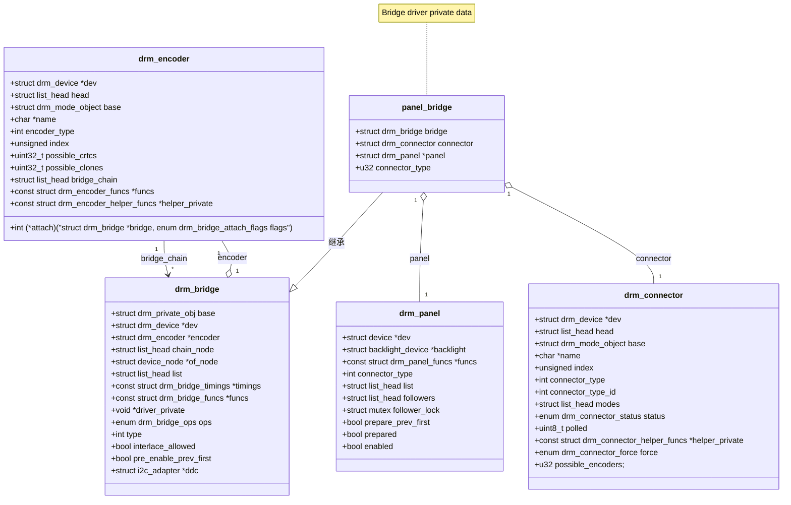
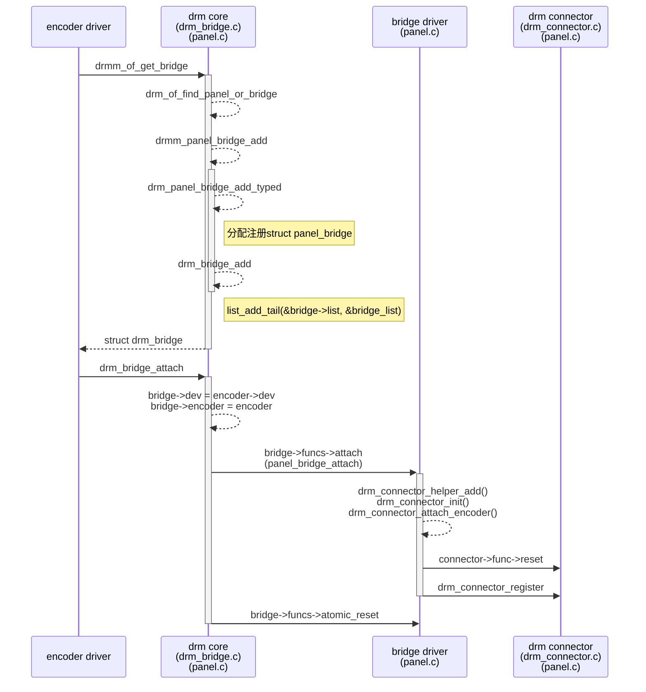

# Overview

struct drm_bridge 代表挂在 encoder 后面的设备。当 drm_encoder 不能完全代表整个 encoder chain 的时候，
drm_bridge 就有用了。

Encoder --> Bridge A --> Bridge B

drm bridge 和 drm panel 一样，不是 drm_mode_object, 对 userspace 是不可见的。他们只是用来提供额外的 hooks 来得到 encoder chain 最终的理想输出。

Display driver 负责把 encoder link 到第一个 bridge，通过`devm_drm_of_get_bridge()`获取 bridge，再通过`drm_bridge_attach()`将 bridge attach 到 encoder 上。

Bridge driver 负责把自己 link 到下一级 bridge，通过在 drm_bridges_funcs.attach 中调用`drm_bridge_attach()`。

最后一级 Bridge driver 还参与实现 drm connector, 通过`drm_bridge_connector_init()` helper 来创建 drm_connector. 或者通过 bridge 暴露出来的 connector 相关操作函数来手动实现 connector.

# bridge driver

在这里我们考虑设备树中只存在 panel node，而不存在 bridge node 的情况。

# Data Structure

```c++
struct drm_bridge {
	struct drm_private_obj base;
	struct drm_device *dev;
	struct drm_encoder *encoder;
	struct list_head chain_node;
	struct device_node *of_node;
	struct list_head list;
	const struct drm_bridge_timings *timings;
	const struct drm_bridge_funcs *funcs;
	void *driver_private;
	enum drm_bridge_ops ops;
	int type;
	bool interlace_allowed;
	struct i2c_adapter *ddc;
	struct mutex hpd_mutex;
	void (*hpd_cb)(void *data, enum drm_connector_status status);
	void *hpd_data;
};
```

encoder: bridge 连接的 encoder

of_node: bridge 在设备树中对应的节点

type: bridge output 的格式 DRM_MODE_CONNECTOR_*

interlace_allowed: bridge 是否能处理 interlace mode

```c++
struct drm_bridge_state {
	struct drm_private_state base;
	struct drm_bridge *bridge;
	struct drm_bus_cfg input_bus_cfg;
	struct drm_bus_cfg output_bus_cfg;
}
```

```c++
struct drm_bridge_funcs {
	int (*attach)(struct drm_bridge *bridge,
		      enum drm_bridge_attach_flags flags);
	void (*detach)(struct drm_bridge *bridge);
	enum drm_mode_status (*mode_valid)(struct drm_bridge *bridge,
					   const struct drm_display_info *info,
					   const struct drm_display_mode *mode);
	bool (*mode_fixup)(struct drm_bridge *bridge,
			   const struct drm_display_mode *mode,
			   struct drm_display_mode *adjusted_mode);
	void (*atomic_pre_enable)(struct drm_bridge *bridge,
				  struct drm_bridge_state *old_bridge_state);
	void (*atomic_enable)(struct drm_bridge *bridge,
			      struct drm_bridge_state *old_bridge_state);
	void (*atomic_disable)(struct drm_bridge *bridge,
			       struct drm_bridge_state *old_bridge_state);
	void (*atomic_post_disable)(struct drm_bridge *bridge,
				    struct drm_bridge_state *old_bridge_state);
	struct drm_bridge_state *(*atomic_duplicate_state)(struct drm_bridge *bridge);
	void (*atomic_destroy_state)(struct drm_bridge *bridge,
				     struct drm_bridge_state *state);
	u32 *(*atomic_get_output_bus_fmts)(struct drm_bridge *bridge,
					   struct drm_bridge_state *bridge_state,
					   struct drm_crtc_state *crtc_state,
					   struct drm_connector_state *conn_state,
					   unsigned int *num_output_fmts);
	u32 *(*atomic_get_input_bus_fmts)(struct drm_bridge *bridge,
					  struct drm_bridge_state *bridge_state,
					  struct drm_crtc_state *crtc_state,
					  struct drm_connector_state *conn_state,
					  u32 output_fmt,
					  unsigned int *num_input_fmts);
	int (*atomic_check)(struct drm_bridge *bridge,
			    struct drm_bridge_state *bridge_state,
			    struct drm_crtc_state *crtc_state,
			    struct drm_connector_state *conn_state);
	struct drm_bridge_state *(*atomic_reset)(struct drm_bridge *bridge);
	enum drm_connector_status (*detect)(struct drm_bridge *bridge);
	int (*get_modes)(struct drm_bridge *bridge,
			 struct drm_connector *connector);
	const struct drm_edid *(*edid_read)(struct drm_bridge *bridge,
					    struct drm_connector *connector);
	void (*hpd_notify)(struct drm_bridge *bridge,
			   enum drm_connector_status status);
	void (*hpd_enable)(struct drm_bridge *bridge);
	void (*hpd_disable)(struct drm_bridge *bridge);
	void (*debugfs_init)(struct drm_bridge *bridge, struct dentry *root);
};
```

`attach`: optional, attach bridge to encoder, invoked in **drm_bridge_attach**

`detach`: optional, detach bridge to encoder

`mode_valid`: optional, check display mode restraints in bridge

`mode_fixup`: optional, fix display mode and store into adjusted mode

`atomic_pre_enable`: optional, enable bridge before the preceding element is enabled(like encoder enable function).

`atomic_enable`: optional, enable bridge after the preceding element is enabled

`atomic_disable`: optional, disable bridge before the preceding element is disabled

`atomic_post_disable`: optional, disable bridge after the preceding element is disabled

`atomic_duplicate_state`: mandatory, duplicate drm_bridge_state. If &drm_bridge_state is note subclassed, then use **drm_atomic_helper_bridge_duplicate_state**

`atomic_destroy_state`: mandatory, **drm_atomic_helper_bridge_destroy_state**

`atomic_get_output_bus_fmts`:

`atomic_get_input_bus_fmts`:

`atomic_check`: 检查

`atomic_reset`:

`detect`:

`get_modes`:

`edid_read`:

`hpd_notify`:

`hpd_enable`:

`hpd_disable`:



# API

bridge:

```c++
void drm_bridge_add(struct drm_bridge *bridge);
int devm_drm_bridge_add(struct device *dev, struct drm_bridge *bridge);
void drm_bridge_remove(struct drm_bridge *bridge);
int drm_bridge_attach(struct drm_encoder *encoder, struct drm_bridge *bridge,
		      struct drm_bridge *previous,
		      enum drm_bridge_attach_flags flags);
struct drm_bridge *of_drm_find_bridge(struct device_node *np);
```


