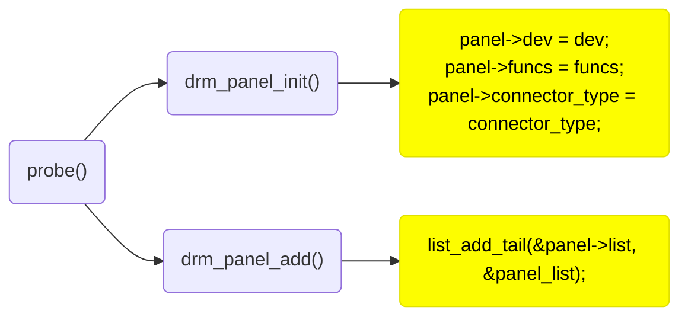
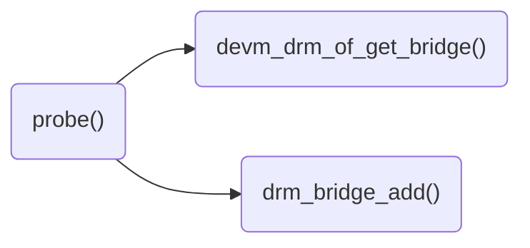
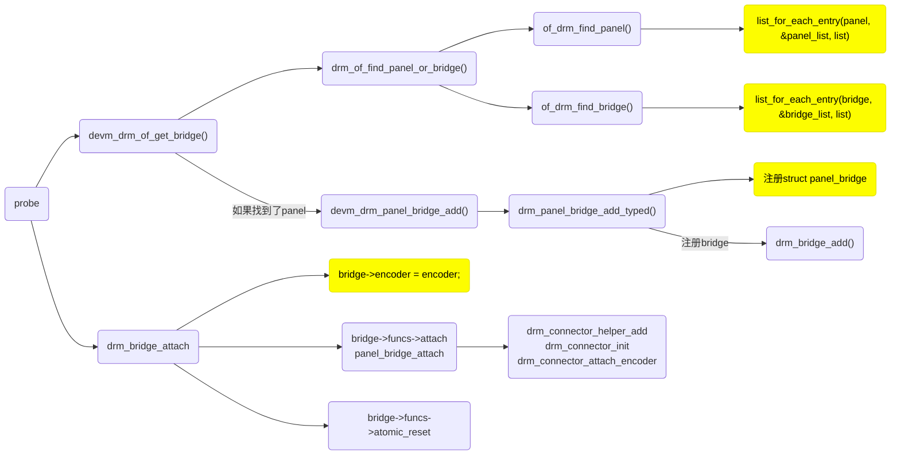

# Panel and Bridge

对于 dpi, mipi dsi connector, DRM core 提供了 `struct drm_panel` 来简化流程。

## 情况 1：设备树存在 panel 节点

imx6ull-dhcom-pdk2.dts 中的存在 panel 节点，对应 panel-simple.c:

```dts
&lcdif {
	status = "okay";

	port {
		display_out: endpoint {
			remote-endpoint = <&panel_in>;
		};
	};
};

panel {
	compatible = "auo,g101evn010";
	power-supply = <&ldo4_ext>;
	backlight = <&lcd_backlight>;

	port {
		panel_in: endpoint {
			remote-endpoint = <&display_out>;
		};
	};
};
```

这种情况比较简单，在底层 driver 中调用**drm_of_find_panel_or_bridge**找到设备树中的 panel 节点，和 panel driver 匹配，找到 panel driver 注册的 **drm_panel** 结构体。

再调用**devm_drm_panel_bridge_add**, 分配 panel_bridge, 注册一个固定的**drm_bridge**。

最后调用**drm_bridge_attach**, 调用到 bridge->funcs->attach, 即 panel_bridge_attach, 注册 connector，以及把 connector attach 到 encoder。

## 情况 2：设备树存在 bridge 节点，connector 节点

da850-lcdk.dts 中存在 bridge 和 connector 节点，对应 simple-bridge.c:

```dts
&lcdc {
	compatible = "ti,da850-tilcdc";
	status = "okay";

	port {
		lcdc_out_vga: endpoint {
			remote-endpoint = <&vga_bridge_in>;
		};
	};
};

vga-bridge {
	compatible = "ti,ths8135";
	#address-cells = <1>;
	#size-cells = <0>;

	ports {
		#address-cells = <1>;
		#size-cells = <0>;

		port@0 {
			reg = <0>;

			vga_bridge_in: endpoint {
				remote-endpoint = <&lcdc_out_vga>;
			};
		};

		port@1 {
			reg = <1>;

			vga_bridge_out: endpoint {
				remote-endpoint = <&vga_con_in>;
			};
		};
	};
};

vga {
	compatible = "vga-connector";

	ddc-i2c-bus = <&i2c0>;

	port {
		vga_con_in: endpoint {
			remote-endpoint = <&vga_bridge_out>;
		};
	};
};
```

底层 driver 仍然调用**drm_of_find_panel_or_bridge**函数，因为 panel 节点不存在，所以会找到设备树中的 bridge 节点，和 bridge driver 匹配，找到 bridge driver 注册的 **drm_bridge** 结构体。

再调用**drm_bridge_attach**, 调用到 bridge->funcs->attach, 即 simple_bridge_attach。

在这个函数中又会调用一次 drm_bridge_attach，不过这个时候传入的 bridge 为设备树中 port@1 中的 remote-endpoint 节点，对应的是 connector。

最后注册 connector，以及把 connector attach 到 encoder。

## 数据结构

```c++
struct drm_panel {
	struct device *dev;
	struct backlight_device *backlight;
	const struct drm_panel_funcs *funcs;
	int connector_type;
	struct list_head list;
	struct list_head followers;
	struct mutex follower_lock;
	bool prepare_prev_first; // 确保在调用 panel prepare 之前，mipi dsi driver 初始化完成，主动置起该 flag
	bool prepared; // panel 是否 prepared，在 drm_panel_prepare 中置起
	bool enabled; // panel 是否 enable，在 drm_panel_enable 中置起
};
```

```c++
struct drm_panel_funcs {
	int (*prepare)(struct drm_panel *panel);
	int (*enable)(struct drm_panel *panel);
	int (*disable)(struct drm_panel *panel);
	int (*unprepare)(struct drm_panel *panel);
	int (*get_modes)(struct drm_panel *panel,
			 struct drm_connector *connector);
	enum drm_panel_orientation (*get_orientation)(struct drm_panel *panel);
	int (*get_timings)(struct drm_panel *panel, unsigned int num_timings,
			   struct display_timing *timings);
	void (*debugfs_init)(struct drm_panel *panel, struct dentry *root);
};
```

`prepare`: optinal, 做一些 setup 工作，在 drm_panel_prepare 中调用

`enable`: optional, enable panel, 打开背光等，在 drm_panel_enable 中调用

`disable`: optional, 在 drm_panel_disable 中调用

`unprepare`: optional, 和 prepare 相反

`get_modes`: mandatory, 把 panel 支持的 mode 加入到 connector->probed_modes 中。在 drm_panel_get_modes 中调用，如果 drvier 绑定了 panel，那么 connector 的 get_modes 回调，直接调用 drm_panel_get_modes 就可以

`get_orientation`: optional, 从设备树或者 edid 中获取 panel 的方向

`get_timings`: optional, 返回 panel driver 中 fixed timing，这个回调看起来没怎么用到

# APIs

panel:

```c++
void drm_panel_init(struct drm_panel *panel, struct device *dev,
		    const struct drm_panel_funcs *funcs,
		    int connector_type);

void drm_panel_add(struct drm_panel *panel);
void drm_panel_remove(struct drm_panel *panel);

int drm_panel_prepare(struct drm_panel *panel);
int drm_panel_unprepare(struct drm_panel *panel);

int drm_panel_enable(struct drm_panel *panel);
int drm_panel_disable(struct drm_panel *panel);

int drm_panel_get_modes(struct drm_panel *panel, struct drm_connector *connector);

struct drm_panel *of_drm_find_panel(const struct device_node *np);
int of_drm_get_panel_orientation(const struct device_node *np,
				 enum drm_panel_orientation *orientation);
int drm_panel_of_backlight(struct drm_panel *panel);
```

# function flow

**panel driver:**



**bridge driver**



**drm driver:**


