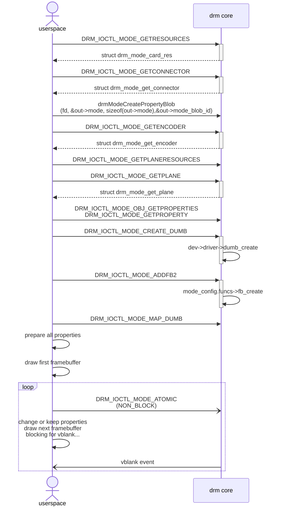
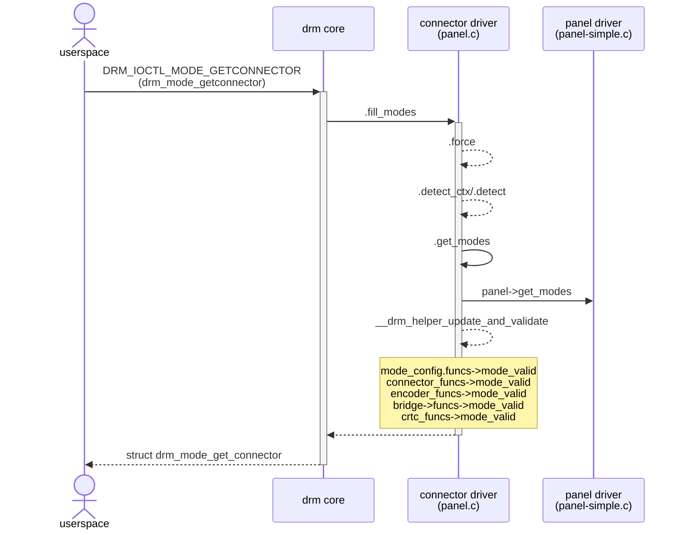
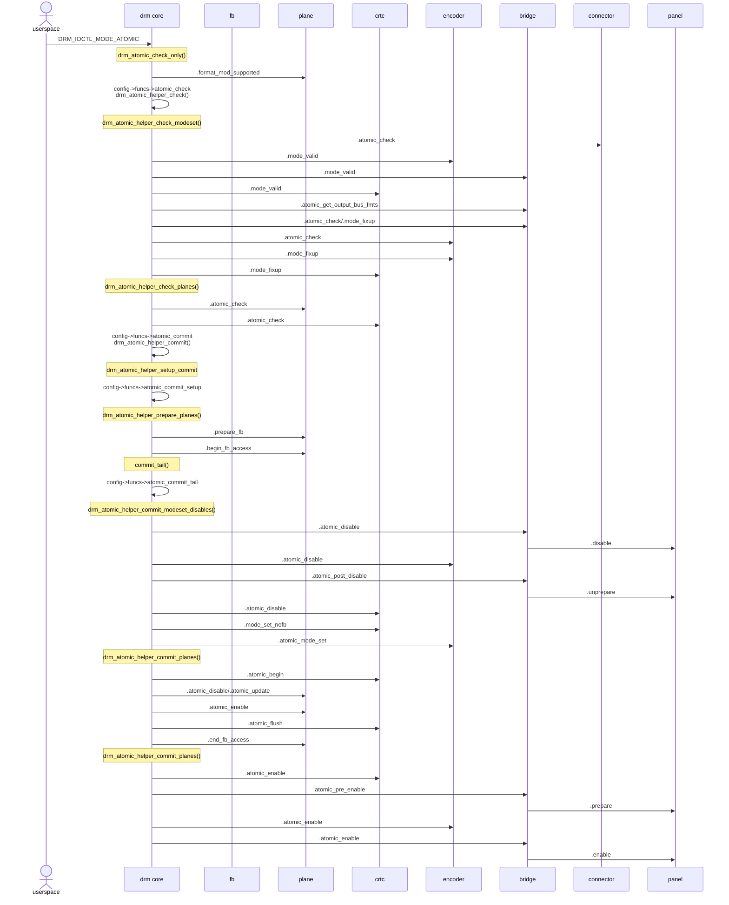

# Atomic Mode Setting

在 DRM 子系统中，atomic mode setting 是指一种用于显示配置更新的机制，它允许将多个显示参数的变更作为一个原子性的操作一次性提交和应用。
整个更新作为一个单元被处理，不会出现部分应用的情况，所有显示参数的变更在同一个垂直消隐期间同步生效。


drm_atomic_state - 包含整个显示状态的快照

drm_crtc_state, drm_plane_state, drm_connector_state - 各组件的状态对象

crtc, plane, connector object 都包含一个 state，drm_plane_state, drm_crtc_state, drm_connector_state，这些 state 是在 atomic 过程中用户可见并且设置的。

在 driver 内部，如果需要保存一些内部状态，可以 subclass 这些 state，或者一个整体的 drm_private_state.

## Handling Driver Private State

通常 DRM objects (connector, crtc, plane) 不能与硬件完全的匹配映射。
比如在 planes, crtc 等之间一些共享的资源，shared clock, scaler units, bandwidth, fifo limits.

这时候我们需要创建一个仅内部可见的 private state.

```c++
struct drm_private_state {
    struct drm_atomic_state *state;
    struct drm_private_obj *obj;
};
```

state: backpointer，指向 atomic state  
obj: backpointer，指向 private object

某个私有 object 对应的结构体：

```c++
struct drm_private_obj {
    struct list_head head;
    struct drm_modeset_lock lock;
    struct drm_private_state *state;
    const struct drm_private_state_funcs *funcs;
};
```

## Data Structure and api

用来 track crtc commit 的结构体：

```c++
struct drm_crtc_commit {
    struct drm_crtc *crtc;
    struct kref ref;
    struct completion flip_done;
    struct completion hw_done;
    struct completion cleanup_done;
    struct list_head commit_entry;
    struct drm_pending_vblank_event *event;
    bool abort_completion;
};
```

flip_done: 显示 buffer 切换后置起。drm_atomic_helper_setup_commit 中，new_crtc_state->event->base.completion = &commit->flip_done. 在 drm_crtc_send_vblank_event 中 complete_all(e->completion).

hw_done: 所有硬件操作都完成后置起。在 drm_atomic_helper_commit_hw_done 中 complete_all(hw_done)

cleanup_done: clean 工作完成后置起。在 drm_atomic_helper_commit_cleanup_done 中 complete_all(cleanup_done)

三者的顺序为 hw_done->flip_done->cleanup_done

```c++
struct drm_atomic_state {
    struct kref ref;
    struct drm_device *dev;
    bool allow_modeset : 1;
    bool async_update : 1;
    bool duplicated : 1;
    struct __drm_planes_state *planes;
    struct __drm_crtcs_state *crtcs;
    int num_connector;
    struct __drm_connnectors_state *connectors;
    int num_private_objs;
    struct __drm_private_objs_state *private_objs;
    struct drm_modeset_acquire_ctx *acquire_ctx;
    struct drm_crtc_commit *fake_commit;
    struct work_struct commit_work;
};
```

allow_modeset: app atomic commit 时传递 flag DRM_MODE_ATOMIC_ALLOW_MODESET 置 1.  
async_update: asynchronous plane update.
duplicated: 表示 atomic_state 是否有被复制过。

## atomic flow

driver 初始化：

```c++
drm_mode_config_reset()
	crtc->funcs->reset(crtc) // drm_atomic_helper_crtc_reset()
		crtc->state = crtc_state; // 初始化 crtc->state
```

atomic commit:

```c
drm_mode_atomic_ioctl()
	drm_atomic_state_alloc()
	drm_atomic_set_property()
		drm_atomic_get_crtc_state()
			crtc_state = crtc->funcs->atomic_duplicate_state(crtc);
			// 此时 state, old_state, new_state 内容是相同的，但 state 和 new_state 指向新的内存区域
			state->crtcs[index].state = crtc_state;
			state->crtcs[index].old_state = crtc->state;
			state->crtcs[index].new_state = crtc_state;
			state->crtcs[index].ptr = crtc;
			crtc_state->state = state;	
		drm_atomic_crtc_set_property();
			// 设置上面 state 和 new state 指向的 crtc_state
	drm_atomic_check_only()
	drm_atomic_commit()
		config->funcs->atomic_commit() // drm_atomic_helper_commit()
			drm_atomic_helper_setup_commit()
				stall_checks()
				new_crtc_state->commit = commit;
				new_crtc_state->event = commit->event;
				new_crtc_state->event->base.completion = &commit->flip_done;
				state->crtcs[i].commit = commit;
			drm_atomic_helper_prepare_planes()
			drm_atomic_helper_swap_state()
			commit_tail()
				drm_atomic_helper_commit_tail()
```

block commit 肯定是在一次 atomic commit 完成后才会提交第二次 commit。

而 non-block 可能存在几个 commit 同时在 kernel 中处理的情况，
分析下第一次 commit，第二次 commit，第三次 commit 之间存在差异的地方。

函数流程：

```c++
drm_atomic_helper_commit();
	drm_atomic_helper_setup_commit();
		stall_check();
	drm_atomic_helper_swap_state();
	commit_tail();
		drm_atomic_helper_wait_for_dependencies();
	drm_atomic_helper_commit_tail();
		drm_atomic_helper_commit_modeset_disables();
		drm_atomic_helper_commit_planes();
		drm_atomic_helper_commit_modeset_enables();
			crtc_funcs->atomic_enable();
				drm_crtc_vblank_on();
		drm_atomic_helper_commit_hw_done();
			complete_all(&commit->hw_done);
		drm_atomic_helper_wait_for_vblanks();
		drm_atomic_helper_cleanup_planes();
	drm_atomic_helper_commit_cleanup_done();
		complete_all(&commit->cleanup_done);
```

第一次 commit:

```c++
stall_check(); // 第一次 commit, 前面没有 stall 的 commit，所以这边直接返回 0
	return 0;

int drm_atomic_helper_swap_state(struct drm_atomic_state *state, bool stall)
{
	for_each_oldnew_crtc_in_state(state, crtc, old_crtc_state, new_crtc_state, i) {
		old_crtc_state->state = state;
		new_crtc_state->state = NULL;
		state->crtcs[i].state = old_crtc_state;
		crtc->state = new_crtc_state; // crtc->state 切到 new_crtc_state

		if (new_crtc_state->commit) {
			spin_lock(&crtc->commit_lock);
			// 把 new_crtc_state->commit 加入到 crtc->commit_list 中
			list_add(&new_crtc_state->commit->commit_entry,
				 &crtc->commit_list);
			spin_unlock(&crtc->commit_lock);

			new_crtc_state->commit->event = NULL;
		}
	}	
}


drm_atomic_helper_wait_for_dependencies(); // 第一次 commit，不用等待 old commit 的 hw_done 和 flip_done
	return 0;
```

第二次 commit, 如果此时第一次 commit 已经完成 cleanup 工作了，那么和第一次 commit 的流程是一样的。

如果此时第一次 commit 还没完成：

```c++
static int stall_checks(struct drm_crtc *crtc, bool nonblock)
{
	struct drm_crtc_commit *commit, *stall_commit = NULL;
	bool completed = true;
	int i;
	long ret = 0;

	i = 0;
	/// 第二次 commit，如果前一次 commit 还没 cleanup，commit_list 中就保留着第一次 commit
	list_for_each_entry(commit, &crtc->commit_list, commit_entry) {
		//
		if (i == 0) {
			/// 如果前一次 commit flip done 还没执行完，那么 completed 为 false
			completed = try_wait_for_completion(&commit->flip_done);
		}

		i++;
	}

	if (!stall_commit)
		return 0;
}
```

</br>

userspace 和 kernel 交互：



</br>

get connector:



atomic commit:


