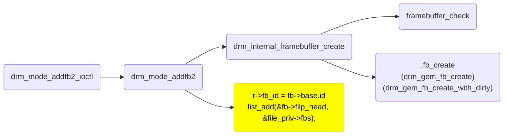
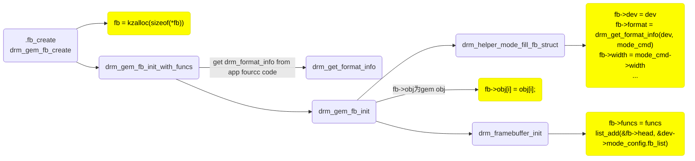

# Framebuffer

帧缓冲区是抽象的内存对象，提供了扫描到 CRTC 的像素源。应用程序通过 IOCTL`DRM_IOCTL_MODE_ADDFB(2)`来创建 framebuffer，会返回一个不透明句柄，该句柄可以传递给 KMS CRTC、来控制 plane configuration 和 page flip 功能。

framebuffer 依赖底层的内存管理器来分配内存。创建 framebuffer 时，app 需要通过`struct drm_mode_fb_cmd2`传入一个 memory handle。

## Data structures and apis

```c++
struct drm_framebuffer {
	struct drm_device *dev;
	struct list_head head;
	struct drm_mode_object base;
	char comm[TASK_COMM_LEN];
	const struct drm_format_info *format;
	const struct drm_framebuffer_funcs *funcs;
	unsigned int pitches[DRM_FORMAT_MAX_PLANES];
	unsigned int offsets[DRM_FORMAT_MAX_PLANES];
	uint64_t modifier;
	unsigned int width;
	unsigned int height;
	int flags;
	struct list_head filp_head;
	struct drm_gem_object *obj[DRM_FORMAT_MAX_PLANES];
};
```

`head`: fb 链表节点。

`comm`: allocate fb 的进程名。

`format`: fb pixel format。

`pitches`: 一行多少 bytes, 会从用户空间的 drm_mode_fb_cmd2 拷贝过来。

`offsets`: framebuffer 和 actual pixel data 的 offset，也从 drm_mode_fb_cmd2 拷贝过来。

`modifier`: 从 drm_mode_fb_cmd2 的 modifier 拷贝过来，DRM_FORMAT_MOD_XXX。

`width`: framebuffer 宽。

`height`: framebuffer 高。

`flags`: DRM_MODE_FB_INTERLACED, DRM_MODE_FB_MODIFIERS。

```c++
struct drm_framebuffer_funcs {
	void (*destroy)(struct drm_framebuffer *framebuffer);
	int (*create_handle)(struct drm_framebuffer *fb,
			     struct drm_file *file_priv,
			     unsigned int *handle);
	int (*dirty)(struct drm_framebuffer *framebuffer,
		     struct drm_file *file_priv, unsigned flags,
		     unsigned color, struct drm_clip_rect *clips,
		     unsigned num_clips);
};
```

`destroy`: 释放 framebuffer 的内存。

`create_handle`: 创建 framebuffer 的 handle。

`dirty`: 有些硬件在 fb 内容更新后不会主动刷新内容到屏幕上。userspace 需要通过 DRM_IOCTL_MODE_DIRTYFB ioctl 调用到 dirty 函数来刷新屏幕的某块区域。

## 注册 framebuffer 流程

用户空间通过 `drmModeAddFB2()` 或 `drmModeAddFB2WithModifiers()` 函数来注册 framebuffer。

```c++
struct drm_mode_fb_cmd2 {
	__u32 fb_id;
	__u32 width;
	__u32 height;
	__u32 pixel_format;
	__u32 flags;
	__u32 handles[4];
	__u32 pitches[4];
	__u32 offsets[4];
	__u64 modifier[4];
};
```

app 传入：

width: fb 的宽。  
height: fb 的高。  
pixel_format: fourcc 格式的 format, DRM_FORMAT_XXXX drm_fourcc.h。  
flags: 可传入 DRM_MODE_FB_INTERLACED 和 DRM_MODE_FB_MODIFIERS。  
handles: 某个 plane 的内存 handle, 从 DRM_IOCTL_MODE_CREATE_DUMB ioctrl 获得。  
pitches: 某个 plane 一行的 bytes 数。  
offsets: 某个 plane 和 fb 起始地址的 offset, 比如 yuv420 planer 格式，那么第二个 plane 和 fb 是有 offset 的。  
modifier: DRM_FORMAT_MOD_XXX，不同厂商自定义的 format 额外信息，4 个 modifier 都要和 modifier[0] 相同。  
另外 DRM_MODE_FB_MODIFIERS 需要被置起，所有 plane 的 modifier 需要相同。  
底层 driver 一般还需要实现 get_format_info 回调来获取自定义 format。

kernel 返回：

fb_id: 注册的 fb id。

**注册 framebuffer 流程：**

```c++
drm_mode_addfb2_ioctl();
	drm_mode_addfb2();
		drm_internal_framebuffer_create();
			framebuffer_check();
			dev->mode_config.funcs->fb_create();
```

`.fb_create`回调有两个 drm 通用的函数，`drm_gem_fb_create`和`drm_gem_fb_create_with_dirty`。

```c++
struct drm_framebuffer *drm_gem_fb_create(struct drm_device *dev,
		struct drm_file *file, const struct drm_mode_fb_cmd2 *mode_cmd)
{
	return drm_gem_fb_create_with_funcs(dev, file, mode_cmd,
					    &drm_gem_fb_funcs);
}

struct drm_framebuffer * drm_gem_fb_create_with_dirty(struct drm_device *dev,
		struct drm_file *file, const struct drm_mode_fb_cmd2 *mode_cmd)
{
	return drm_gem_fb_create_with_funcs(dev, file, mode_cmd,
					    &drm_gem_fb_funcs_dirtyfb);
}
```

可以看出区别是传入`drm_gem_fb_create_with_func`的`drm_framebuffer_funcs`不同，多实现了一个`.dirty`回调，该回调的作用见 drm_framebuffer_funcs 中的注释。

```c++
static const struct drm_framebuffer_funcs drm_gem_fb_funcs = {
	.destroy	= drm_gem_fb_destroy,
	.create_handle	= drm_gem_fb_create_handle,
};

static const struct drm_framebuffer_funcs drm_gem_fb_funcs_dirtyfb = {
	.destroy	= drm_gem_fb_destroy,
	.create_handle	= drm_gem_fb_create_handle,
	.dirty		= drm_atomic_helper_dirtyfb,
};
```

```c++
drm_gem_fb_create_with_funcs();
	drm_gem_fb_init_with_funcs();
		drm_gem_fb_init();
			fb->obj[i] = obj[i];
			drm_helper_mode_fill_fb_struct(); /// 根据 userspace 传入的 mode_cmd，填充 fb 结构体
				fb->dev = dev;
				fb->format = drm_get_format_info(dev, mode_cmd);
				fb->width = mode_cmd->width;
				fb->height = mode_cmd->height;
				for (i = 0; i < 4; i++) {
					fb->pitches[i] = mode_cmd->pitches[i];
					fb->offsets[i] = mode_cmd->offsets[i];
				}
				fb->modifier = mode_cmd->modifier[0];
				fb->flags = mode_cmd->flags;
			drm_framebuffer_init(); /// 填充 fb->funcs 和 drm_mode_object
				fb->funcs = funcs;
				strcpy(fb->comm, current->comm);
				list_add(&fb->head, &dev->mode_config.fb_list);
				__drm_mode_object_add();

```





apis:

```c++
int drm_framebuffer_init(struct drm_device *dev,
			 struct drm_framebuffer *fb,
			 const struct drm_framebuffer_funcs *funcs);
struct drm_framebuffer *drm_framebuffer_lookup(struct drm_device *dev,
					       struct drm_file *file_priv,
					       uint32_t id);
void drm_framebuffer_cleanup(struct drm_framebuffer *fb);
static inline void drm_framebuffer_get(struct drm_framebuffer *fb);
static inline void drm_framebuffer_put(struct drm_framebuffer *fb);
static inline uint32_t drm_framebuffer_read_refcount(const struct drm_framebuffer *fb);
static inline void drm_framebuffer_assign(struct drm_framebuffer **p,
					  struct drm_framebuffer *fb);
#define drm_for_each_fb(fb, dev);
```

# DRM Format Handling

在 DRM 子系统中，framebuffer 的 pixel format 使用在 include/uapi/drm/drm_fourcc.h 中定义的 fourcc codes 来描述。除了 fourcc 外，还可以选择性地提供一个 Format Modifier，用于进一步描述 fb 的格式 - 例如平铺（tiling）或压缩（compression）。

## Format Modifiers

// TODO:

## Data structures and apis

```c++
struct drm_format_info {
	u32 format; // FOURCC 格式，DRM_FORMAT_*
	u8 depth; // color depth, legacy field, 设置为 0。
	u8 num_planes; // Number of color planes (1 to 3)
	union {
		// 每个 plane 的 bytes per pixel, legacy field。
		u8 cpp[DRM_FORMAT_MAX_PLANES];
		// 每个 plane 的 bytes per block。用于单个 pixel 不是 byte 对齐的情况。
		// block 大小用下面的 block_w 和 block_h 来描述。
		u8 char_per_block[DRM_FORMAT_MAX_PLANES];
	};
	u8 block_w[DRM_FORMAT_MAX_PLANES]; // block width 占几个 bytes
	u8 block_h[DRM_FORMAT_MAX_PLANES]; // block height 占几个 bytes
	u8 hsub; // 行采样因子
	u8 vsub; // 列采样因子，比如 yuv422 那么 hsub=2, vsub=1
	bool has_alpha; // pixel format 中是否含有 alpha
	bool is_yuv; // 是不是 yuv 格式
	bool is_color_indexed; // 是不是 color_indexed 格式，即伪彩，存 index 进 color LUT 查找对应颜色
};
```
