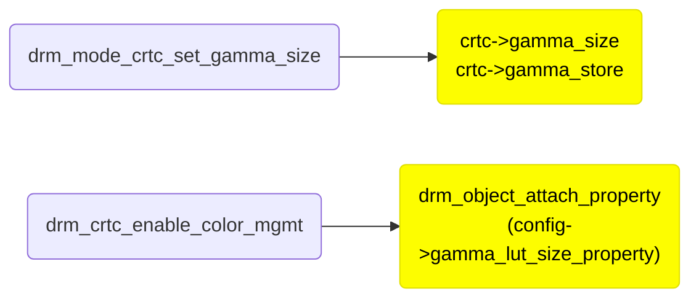

# Data Structure and api

Driver 通过 `drm_mode_crtc_set_gamma_size()` 和 `drm_crtc_enable_color_mgmt()` 初始化 color mangement。

```mermaid
%%{init: {'theme': 'default' }}%%
flowchart LR

A("drm_mode_crtc_set_gamma_size") --> B("crtc->gamma_size<br>crtc->gamma_store"):::yellow

C("drm_crtc_enable_color_mgmt") --> D("drm_object_attach_property<br>(config->gamma_lut_size_property)"):::yellow

classDef yellow fill:#fdfd00,color:#000000,stroke:#e0e000
```

# IOCTL
