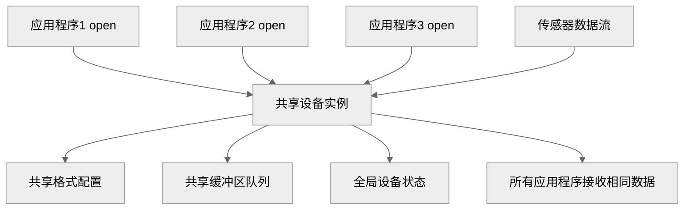
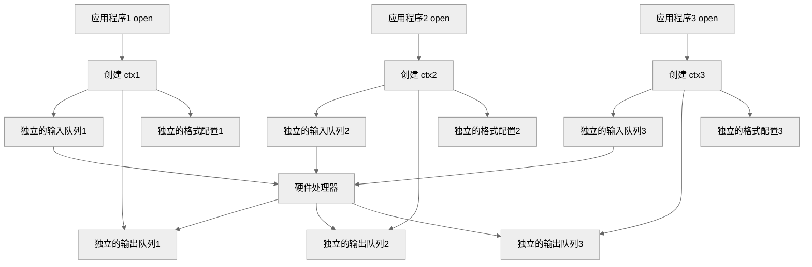
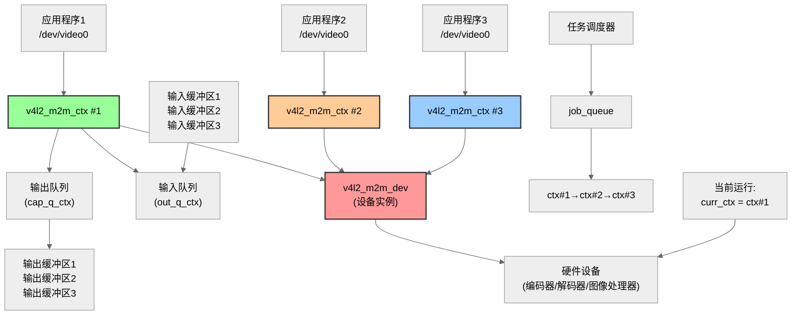
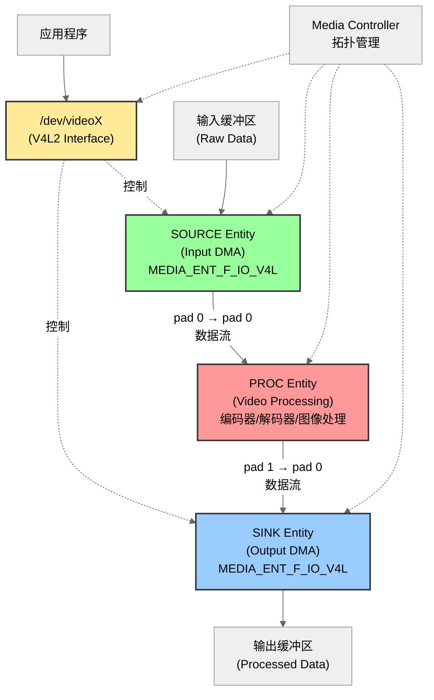
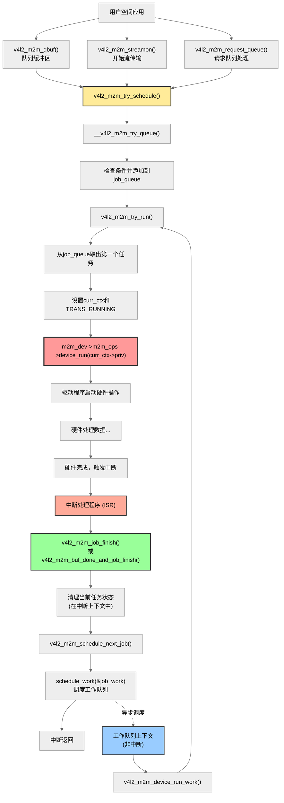

# Overview

V4L2 memory-to-memory 设备可以在内存中 compress, decompress、transform 或以其他方式将视频数据从一种格式转换为另一种格式。此类 memory-to-memory 设备会设置 video device device_caps 的 V4L2_CAP_VIDEO_M2M 或 V4L2_CAP_VIDEO_M2M_MPLANE flag。内存到内存设备的示例包括 codecs、scalers、deinterlacers 或 format converters（例如，从 YUV 转换为 RGB）。

memory-to-memory video device node 的行为与普通 video device node 类似，但它同时支持 output（将 frame 从内存发送到硬件）和 capture（将处理后的 frame 从硬件接收到内存）stream I/O。

memory-to-memory 设备是一种共享资源，可以多次 open video device node，每个 application 通过他们的 file handler 设置属于自己的属性，并且每个 application 都可以独立地使用它。

driver 会 arbitrate 硬件的访问，在其他 file handler 获得访问权限时对硬件进行重新编程。这与 normal video device node 的行为不同，在 normal device node 中，属性是全局的。

normal v4l2 driver:



</br>

v4l2 m2m driver:



# 数据结构

```c++
struct v4l2_m2m_ops {
	void (*device_run)(void*priv);
	int (*job_ready)(void*priv);
	void (*job_abort)(void*priv);
};
```

`device_run`: 必须要实现的回调，在这个回调里执行 job(transaction). job 可能在 callback return 之后仍然没有完成，需要在 job 完成后调用 v4l2_m2m_job_finish() 或者 v4l2_m2m_buf_done_and_job_finish()

`job_ready`: optional, 检查驱动是否已经准备好执行一个完整的 m2m job, 未准备好返回 0，准备好返回 1. 这个函数不可以休眠。

`job_abort`: optional, 停止当前的 m2m job, 需要调用 v4l2_m2m_job_finish() 或者 v4l2_m2m_buf_done_and_job_finish(). 不用阻塞等待清理工作完成便可返回。

</br>

通过 `v4l2_m2m_init()` 函数初始化注册一个 `struct v4l2_m2m_dev` 结构体：

```c++
struct v4l2_m2m_dev {
	struct v4l2_m2m_ctx	*curr_ctx;
#ifdef CONFIG_MEDIA_CONTROLLER
	struct media_entity	*source;
	struct media_pad	source_pad;
	struct media_entity	sink;
	struct media_pad	sink_pad;
	struct media_entity	proc;
	struct media_pad	proc_pads[2];
	struct media_intf_devnode *intf_devnode;
#endif

	struct list_head	job_queue;
	spinlock_t		job_spinlock;
	struct work_struct	job_work;
	unsigned long		job_queue_flags;

	const struct v4l2_m2m_ops *m2m_ops;
};
```

`curr_ctx`: 当前运行的 m2m context.

`job_queue`: 任务链表，存放 v4l2_m2m_ctx->queue 节点。在 v4l2_m2m_try_queue 中添加，在 v4l2_m2m_try_run 中取出。

`job_work`：工作队列，在 v4l2_m2m_job_finish->v4l2_m2m_schedule_next_job 后 schedule work，进入 v4l2_m2m_device_run_work->v4l2_m2m_try_run 从上面的 job_queue 中取出下一个 m2m_ctx, 调用.device_run

`job_queue_flags`: 目前只有 QUEUE_PAUSED, 在 v4l2_m2m_suspend 中置起，v4l2_m2m_resume 中清除，防止 suspend 之后仍然可以 run.

</br>

v4l2_m2m_ctx 结构体和一个 file handler 绑定，代表一个应用程序与设备的会话实例。

一般在 video device file operation 的 .open 回调中创建：

```c++
struct v4l2_m2m_ctx {
	struct mutex			*q_lock;
	bool				new_frame;
	bool				is_draining;
	struct vb2_v4l2_buffer		*last_src_buf;
	bool				next_buf_last;
	bool				has_stopped;
	struct v4l2_m2m_dev		*m2m_dev;
	struct v4l2_m2m_queue_ctx	cap_q_ctx;
	struct v4l2_m2m_queue_ctx	out_q_ctx;
	struct list_head		queue;
	unsigned long			job_flags;
	wait_queue_head_t		finished;
	void				*priv;
};
```

`new_frame`: 如果 m2m_ctx->out_q_ctx.q.subsystem_flags 没有置起 VB2_V4L2_FL_SUPPORTS_M2M_HOLD_CAPTURE_BUF flag 表示 slicing support,
那么每次 try_queue 都会置为 true，暂时没看到哪里利用到了这个 flag。

`is_draining`:

`last_src_buf`:

`next_buf_last`:

`has_stopped`:

`cap_q_ctx/out_q_ctx`: capture/output queue context.

`queue`: v4l2_m2m_dev 中的 job_queue 链表节点

`job_flags`: 当前 context 的状态，有 TRANS_QUEUED/RUNNING/ABORT.

`finished`: 等待队列，用于同步，在 v4l2_m2m_cancel_job() 和 v4l2_m2m_suspend() 中判断 job_flags 是否不是 RUNNING 状态，
如果仍然是 RUNNING 状态，则会睡眠。在 v4l2_m2m_job_finish() 和 v4l2_m2m_streamoff() 中唤醒睡眠进程。

`priv`: driver private m2m context structure.

</br>

```c++
struct v4l2_m2m_queue_ctx {
	struct vb2_queue	q;

	struct list_head	rdy_queue;
	spinlock_t		rdy_spinlock;
	u8			num_rdy;
	bool			buffered;
};
```

`rdy_queue`: m2m ready buffer 链表，在 v4l2_m2m_buf_queue() 中把 buffer 加入链表。

`num_rdy`: ready buffer 的数量。

`buffered`: v4l2_m2m_set_src/dst_buffered() 函数置起 flag，在 v4l2_m2m_try_queue() 中检查。这个 flag 好像没什么 driver 使用。



</br>

接着通过`v4l2_m2m_register_media_controller()` 注册 media entity, pad, link.

拓扑图如下：



# APIs

```c++
// v4l2-mem2mem.h
void *v4l2_m2m_get_curr_priv(struct v4l2_m2m_dev *m2m_dev);
struct vb2_queue *v4l2_m2m_get_vq(struct v4l2_m2m_ctx *m2m_ctx,
				       enum v4l2_buf_type type);
void v4l2_m2m_try_schedule(struct v4l2_m2m_ctx *m2m_ctx);
void v4l2_m2m_job_finish(struct v4l2_m2m_dev *m2m_dev,
			 struct v4l2_m2m_ctx *m2m_ctx);
void v4l2_m2m_buf_done_and_job_finish(struct v4l2_m2m_dev *m2m_dev,
				      struct v4l2_m2m_ctx *m2m_ctx,
				      enum vb2_buffer_state state);
static inline void v4l2_m2m_buf_done(struct vb2_v4l2_buffer *buf, enum vb2_buffer_state state);
static inline void v4l2_m2m_clear_state(struct v4l2_m2m_ctx *m2m_ctx);
static inline void v4l2_m2m_mark_stopped(struct v4l2_m2m_ctx *m2m_ctx);
```

# 流程分析

device run 流程：


