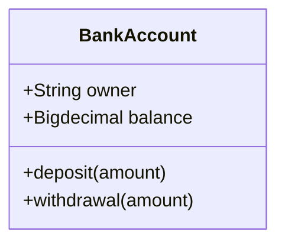
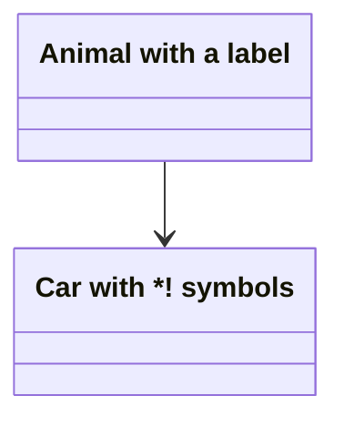
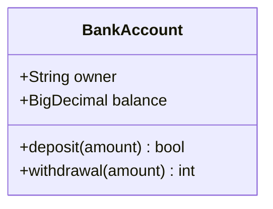
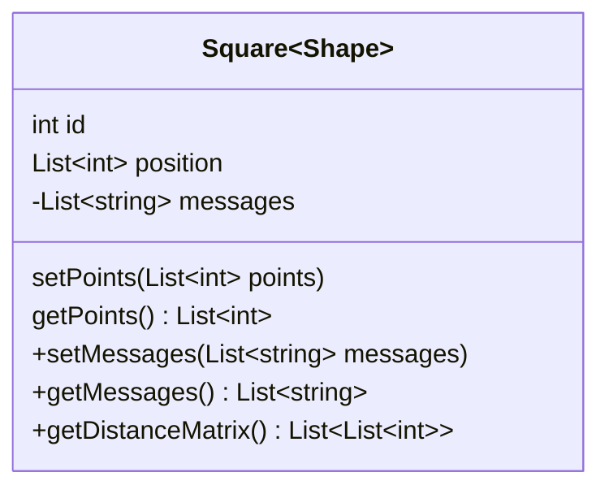
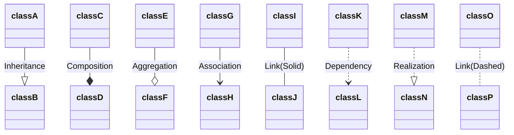
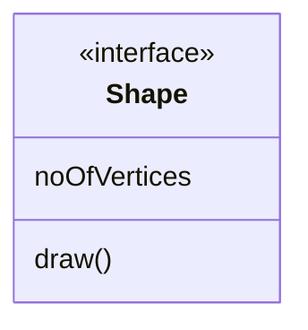
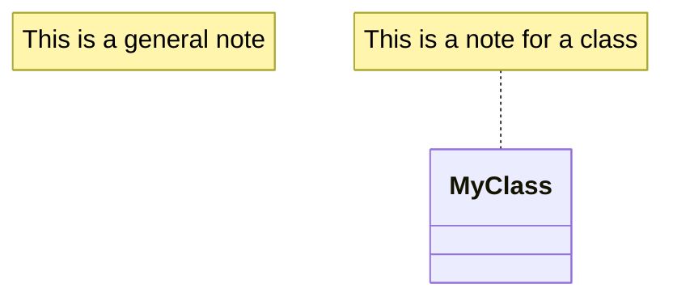

# Syntax

```txt
---
title: Bank example
---
classDiagram
    class BankAccount
    BankAccount : +String owner
    BankAccount : +Bigdecimal balance
    BankAccount : +deposit(amount)
    BankAccount : +withdrawal(amount)
```



# Define a class

**class label**

```txt
classDiagram
    class Animal["Animal with a label"]
    class Car["Car with *! symbols"]
    Animal --> Car
```



# Define members of a class

```txt
classDiagram
class BankAccount{
    +String owner
    +BigDecimal balance
    +deposit(amount)
    +withdrawal(amount)
}
```



区别 attributes 和 methods 的方法是，带`()`的是 methods。

**generic types**

```txt
classDiagram
class Square~Shape~{
    int id
    List~int~ position
    setPoints(List~int~ points)
    getPoints() List~int~
}

Square : -List~string~ messages
Square : +setMessages(List~string~ messages)
Square : +getMessages() List~string~
Square : +getDistanceMatrix() List~List~int~~
```



**Visibility**

在 attributes 和 methods 前加上这些符号来表示更多含义：

- \+ Public
- \- Private
- \# Protected
- \~ Package/Internal

在 () 或者 return type 后面加下面两个符号还能表示 abstract 和 static:

- \- Abstract e.g.: `someAbstractMethod()*` or `someAbstractMethod() int*`
- \$ Static e.g.: `someStaticMethod()$` or `someStaticMethod() String$`

# Define Relationship

```txt
[classA][Arrow][ClassB]
```

| Type | Description |
| ---- | ----------- |
| <\|-- | Inheritance |
| *-- | Composition |
| o-- | Aggregation |
| --> | Association |
| -- | Link (Solid) |
| ..> | Dependency |
| ..\|> | Realization |
| .. | Link (Dashed) |

还可以加标签来描述两个类之间关系：

```txt
[classA][Arrow][ClassB]:LabelText
```

```txt
classDiagram
classA --|> classB : Inheritance
classC --* classD : Composition
classE --o classF : Aggregation
classG --> classH : Association
classI -- classJ : Link(Solid)
classK ..> classL : Dependency
classM ..|> classN : Realization
classO .. classP : Link(Dashed)
```



# Define Namespace

# Cardinality / Multiplicity on relations

# Annotations on classes

- `<<Interface>>` To represent an Interface class
- `<<Abstract>>` To represent an abstract class
- `<<Service>>` To represent a service class
- `<<Enumeration>>` To represent an enum

```txt
classDiagram
class Shape
<<interface>> Shape
Shape : noOfVertices
Shape : draw()
```



# Setting the direction of the diagram

`direction RL`

# Note

```txt
classDiagram
    note "This is a general note"
    note for MyClass "This is a note for a class"
    class MyClass{
    }
```


