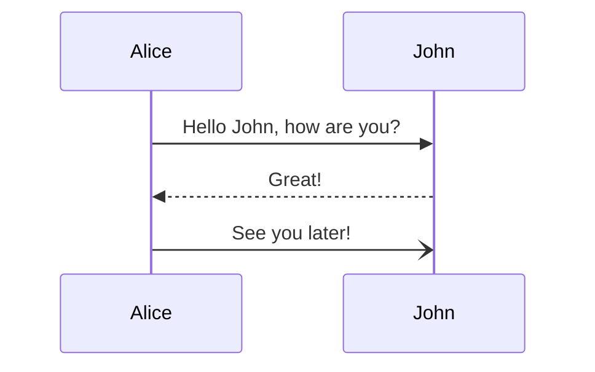
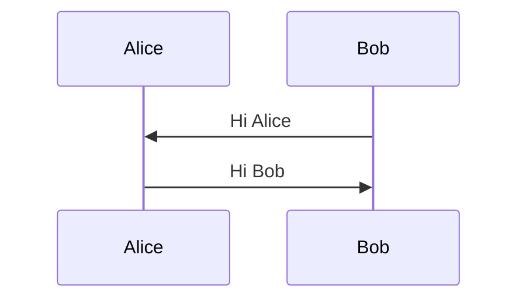
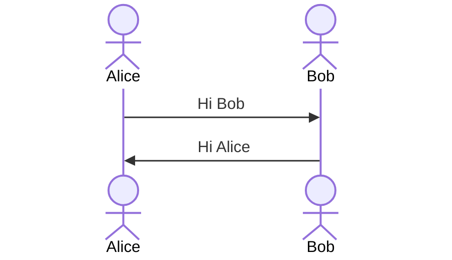
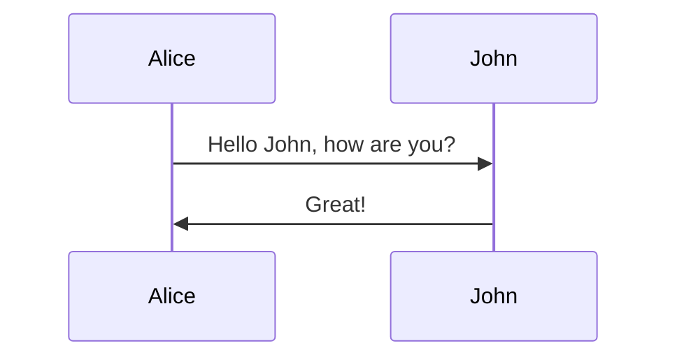
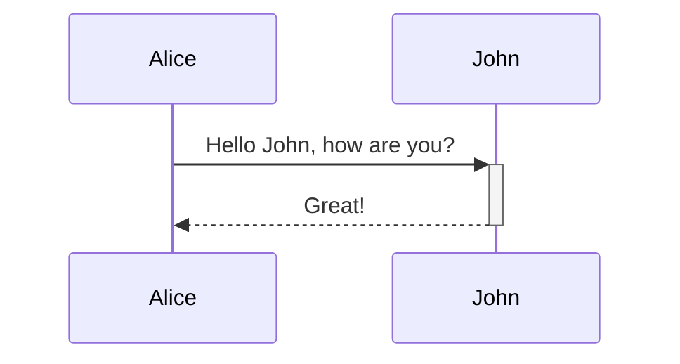
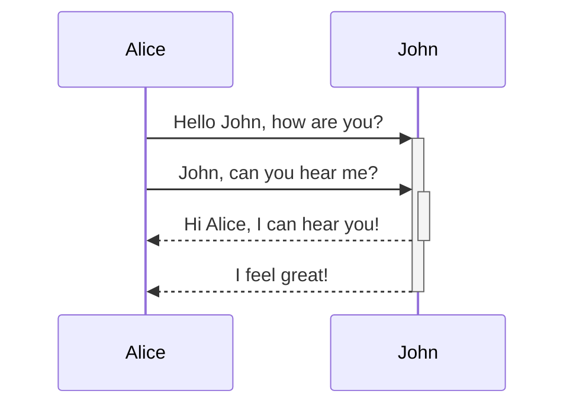
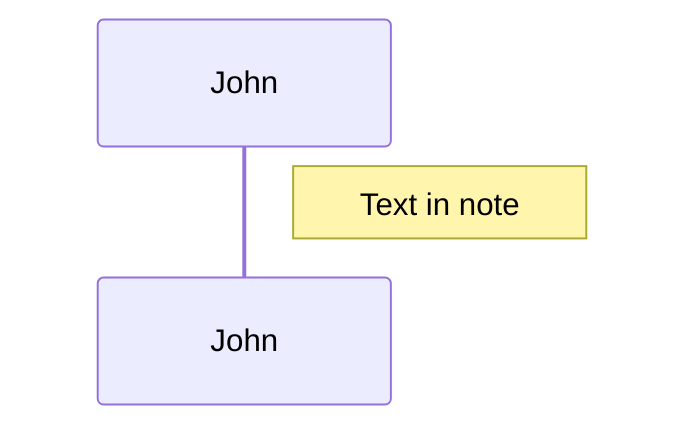
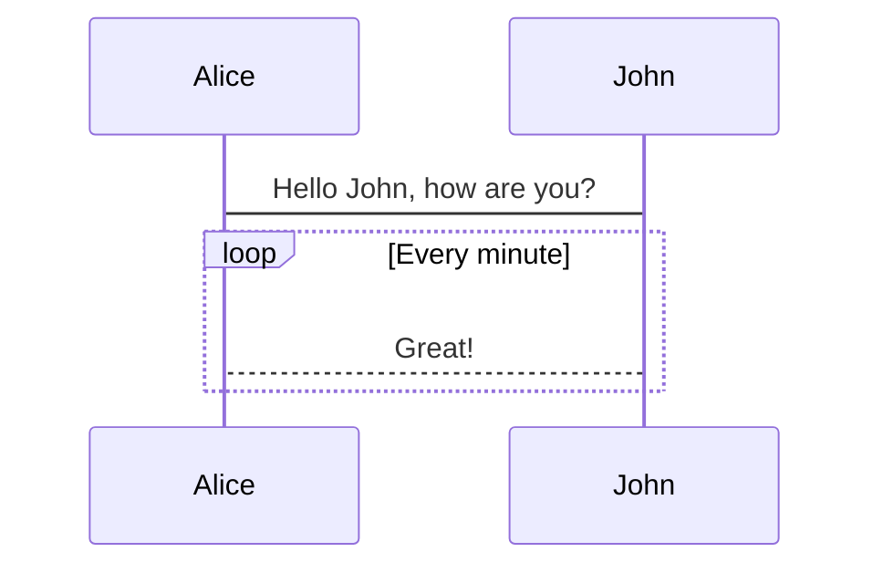
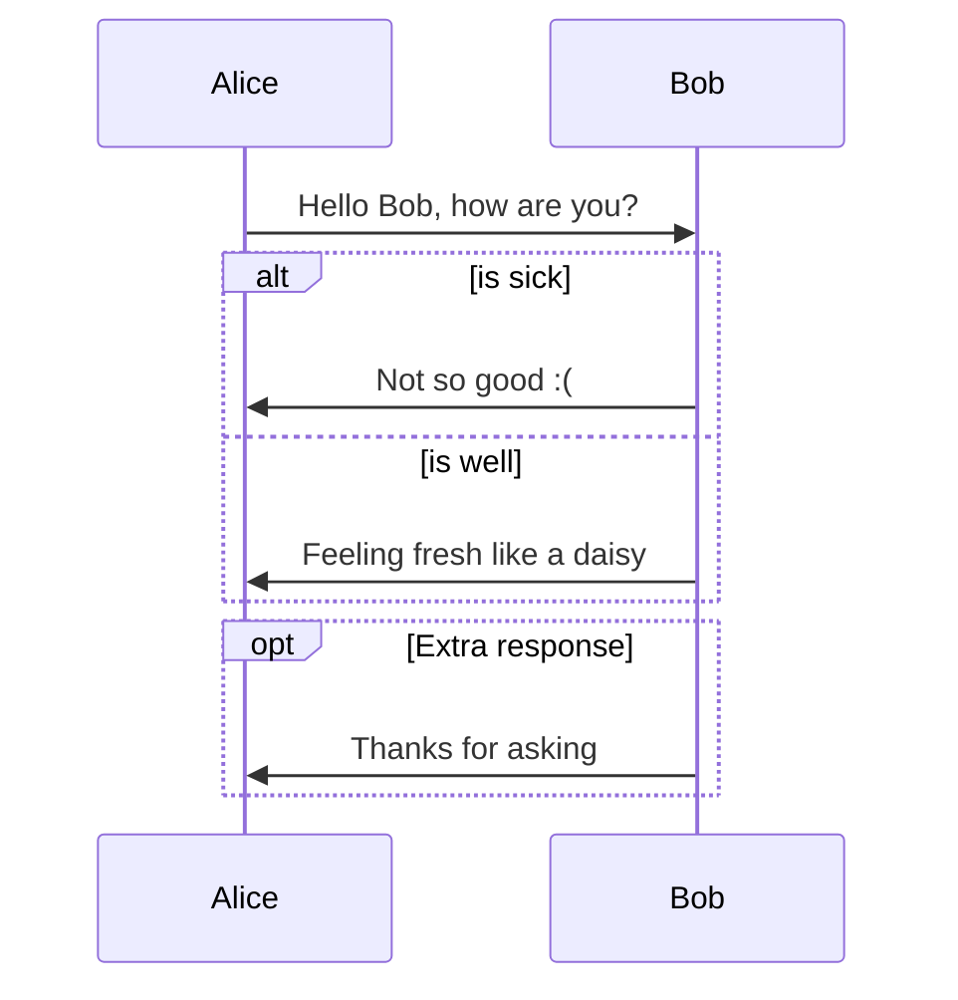
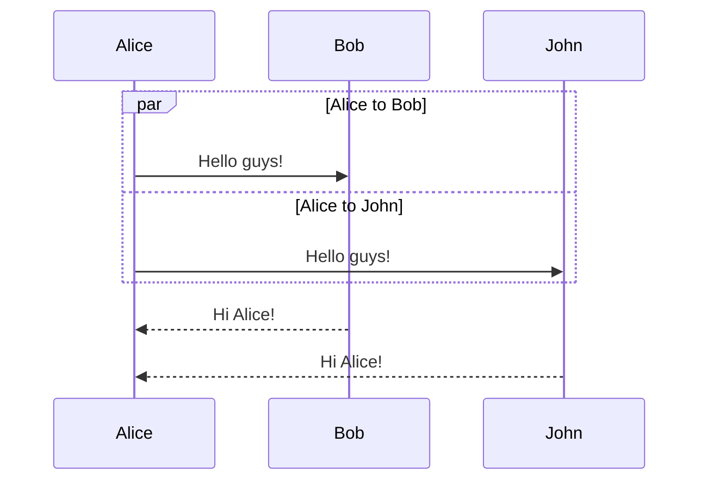

# Syntax

`->>` 同步消息，`-)`异步消息。

```txt
sequenceDiagram
    Alice->>John: Hello John, how are you?
    John-->>Alice: Great!
    Alice-)John: See you later!
```



## Participants

```txt
sequenceDiagram
    participant Alice
    participant Bob
    Bob->>Alice: Hi Alice
    Alice->>Bob: Hi Bob
```



## Actors

actor 会有一个人物的标志。

```txt
sequenceDiagram
    actor Alice
    actor Bob
    Alice->>Bob: Hi Bob
    Bob->>Alice: Hi Alice
```



## Aliases

```txt
sequenceDiagram
    participant A as Alice
    participant J as John
    A->>J: Hello John, how are you?
    J->>A: Great!
```



## Grouping / Box

# Messages


# Activations

```txt
sequenceDiagram
    Alice->>John: Hello John, how are you?
    activate John
    John-->>Alice: Great!
    deactivate John

# 简化方式
sequenceDiagram
    Alice->>+John: Hello John, how are you?
    John-->>-Alice: Great!
```



还可以 stack 起来：

```txt
sequenceDiagram
    Alice->>+John: Hello John, how are you?
    Alice->>+John: John, can you hear me?
    John-->>-Alice: Hi Alice, I can hear you!
    John-->>-Alice: I feel great!
```



# Notes

```txt
sequenceDiagram
    participant John
    Note right of John: Text in note
```



还可以 `Note over Alice,John: A typical interaction`

# Loops

```txt
loop Loop text
... statements ...
end
```



## Alt

```txt
# if else
alt Describing text
... statements ...
else
... statements ...
end

# if
opt Describing text
... statements ...
end
```



# Parallel

```txt
par [Action 1]
... statements ...
and [Action 2]
... statements ...
and [Action N]
... statements ...
end
```



## Critical Region

必须要执行的一段区域。

```txt
critical [Action that must be performed]
... statements ...
option [Circumstance A]
... statements ...
option [Circumstance B]
... statements ...
end
```

# Break

```txt
break [something happened]
... statements ...
end
```

# Background Highlight

```txt
rect COLOR
... content ...
end

rect rgb(0, 255, 0)
... content ...
end

rect rgba(0, 0, 255, .1)
... content ...
end
```

# Comments

```txt
sequenceDiagram
    Alice->>John: Hello John, how are you?
    %% this is a comment
    John-->>Alice: Great!
```

# sequenceNumbers

```txt
sequenceDiagram
    autonumber
```
