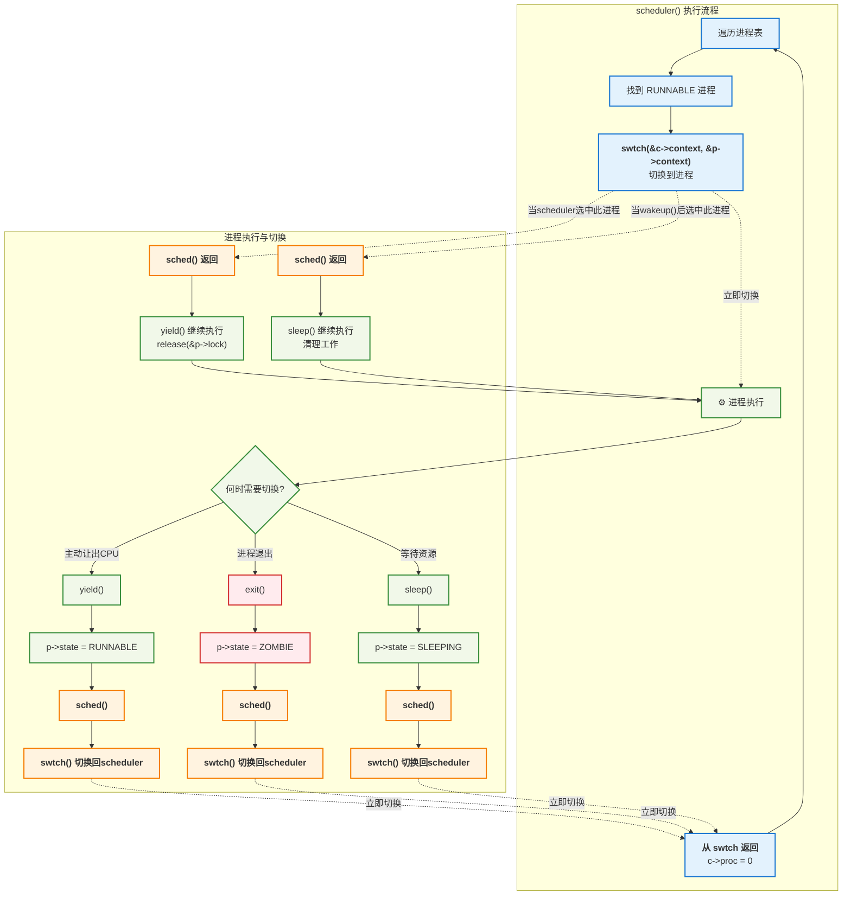

## 7.2 Code: Context switching

## 7.3 Code: Scheduling

```mermaid
graph TD
    subgraph "scheduler() 执行流程"
        S1["遍历进程表"] --> S2["找到 RUNNABLE 进程"]
        S2 --> S3["`**swtch(&c->context, &p->context)**
        切换到进程`"]
        S3 -.->|"立即切换"| P1
        S4["`**从 swtch 返回**
        c->proc = 0`"] --> S1
    end
    
    subgraph "进程执行与切换"
        P1["⚙️ 进程执行"] --> P2{"何时需要切换?"}
        
        P2 -->|"主动让出CPU"| Y1["yield()"]
        P2 -->|"进程退出"| E1["exit()"] 
        P2 -->|"等待资源"| SL1["sleep()"]
        
        Y1 --> Y2["p->state = RUNNABLE"]
        E1 --> E2["p->state = ZOMBIE"] 
        SL1 --> SL2["p->state = SLEEPING"]
        
        Y2 --> SCHED1["`**sched()**`"]
        E2 --> SCHED2["`**sched()**`"]
        SL2 --> SCHED3["`**sched()**`"]
        
        SCHED1 --> SWTCH1["`**swtch() 切换回scheduler**`"]
        SCHED2 --> SWTCH2["`**swtch() 切换回scheduler**`"]
        SCHED3 --> SWTCH3["`**swtch() 切换回scheduler**`"]
        
        SWTCH1 -.->|"立即切换"| S4
        SWTCH2 -.->|"立即切换"| S4
        SWTCH3 -.->|"立即切换"| S4
        
        %% 只有yield和sleep在被重新选中时才返回
        SCHED1_RETURN["`**sched() 返回**`"] --> Y3["yield() 继续执行<br/>release(&p->lock)"]
        SCHED3_RETURN["`**sched() 返回**`"] --> SL3["sleep() 继续执行<br/>清理工作"]
        
        Y3 --> P1
        SL3 --> P1
    end
    
    %% 关键连接：从scheduler的swtch返回到进程的sched
    S3 -.->|"当scheduler选中此进程"| SCHED1_RETURN
    S3 -.->|"当wakeup()后选中此进程"| SCHED3_RETURN
    
    classDef scheduler fill:#e3f2fd,stroke:#1976d2,stroke-width:2px
    classDef process fill:#f1f8e9,stroke:#388e3c,stroke-width:2px
    classDef sched fill:#fff3e0,stroke:#f57c00,stroke-width:2px
    classDef exit fill:#ffebee,stroke:#d32f2f,stroke-width:2px
    classDef dead fill:#424242,stroke:#000,stroke-width:2px,color:#fff
    
    class S1,S2,S3,S4 scheduler
    class P1,P2,Y1,Y2,Y3,SL1,SL2,SL3 process
    class SCHED1,SCHED2,SCHED3,SCHED1_RETURN,SCHED3_RETURN,SWTCH1,SWTCH2,SWTCH3 sched
    class E1,E2 exit
    class DEAD dead
```
