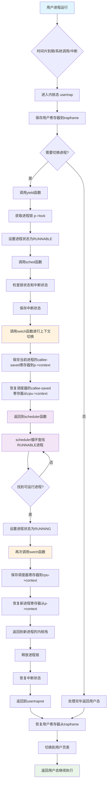

1. 重要的数据结构：

```c++
// 保存内核上下文切换时的寄存器
struct context {
  uint64 ra;    // 返回地址
  uint64 sp;    // 栈指针
  // callee-saved 寄存器 s0-s11
  uint64 s0, s1, s2, s3, s4, s5, s6, s7, s8, s9, s10, s11;
};

// 每个进程的状态
struct proc {
  struct spinlock lock;
  enum procstate state;        // 进程状态
  struct context context;      // 上下文切换时保存的寄存器
  struct trapframe *trapframe; // 用户态寄存器保存区
  // ... 其他字段
};
```

2. 线程切换的触发条件

线程切换主要在以下情况下发生：

- 时间片到期：定时器中断触发
- 进程主动让出 CPU：调用 yield()
- 进程阻塞：等待 I/O 或其他资源时调用 sleep()
- 进程退出：调用 exit()

3. 切换流程详解

**第一阶段：从用户态到内核态**

```c++
// 主动让出 CPU
void yield(void) {
  struct proc *p = myproc();
  acquire(&p->lock);        // 获取进程锁
  p->state = RUNNABLE;      // 设置为可运行状态
  sched();                  // 调用调度函数
  release(&p->lock);        // 释放锁
}
```

**第二阶段：准备上下文切换**

```c++
void sched(void) {
  int intena;
  struct proc *p = myproc();
  
  // 安全性检查
  if(!holding(&p->lock)) panic("sched p->lock");
  if(mycpu()->noff != 1) panic("sched locks");
  if(p->state == RUNNING) panic("sched running");
  if(intr_get()) panic("sched interruptible");

  intena = mycpu()->intena; // 保存中断状态
   // 核心切换，将当前 context 保存到 p->context, 加载 cpu->context
  swtch(&p->context, &mycpu()->context);
  mycpu()->intena = intena; // 恢复中断状态
}
```

**第三阶段：底层寄存器切换**

```c++
swtch:
        # 保存当前进程的callee-saved寄存器到old context
        sd ra, 0(a0)      # 保存返回地址
        sd sp, 8(a0)      # 保存栈指针
        sd s0, 16(a0)     # 保存s0寄存器
        # ... 保存s1-s11寄存器

        # 恢复调度器的callee-saved寄存器从new context
        ld ra, 0(a1)      # 恢复返回地址
        ld sp, 8(a1)      # 恢复栈指针
        ld s0, 16(a1)     # 恢复s0寄存器
        # ... 恢复s1-s11寄存器
        
        ret               # 返回到调度器
```

通过加载 cpu->context, 跳转到 scheduler() 函数的 swtch() 下一句。

注意这边 cpu->context 会在 kernel 第一次运行 scheduler() 函数中设置好 cpu->context.

**第四阶段：调度器选择新进程**

在 schedule() 函数中查找可运行的进程，设置为 RUNNING 状态，调用 swtch() 切换到新进程。

内核在 main() 中启动每个 CPU 的调度器，loop 查找进程运行。

在 userspace 第一个进程 initcode 运行起来后就可以调度了。

```c++
void scheduler(void) {
  struct proc *p;
  struct cpu *c = mycpu();
  
  c->proc = 0;
  for(;;){
    intr_on();  // 开启中断避免死锁
    
    // 遍历进程表寻找 RUNNABLE 进程
    for(p = proc; p < &proc[NPROC]; p++) {
      acquire(&p->lock);
      if(p->state == RUNNABLE) {
        p->state = RUNNING;           // 设置为运行状态
        c->proc = p;                  // 设置当前 CPU 运行的进程
        swtch(&c->context, &p->context);  // 切换到选中的进程
        c->proc = 0;                  // 进程运行结束
      }
      release(&p->lock);
    }
  }
}
```

userinit()->allocproc() 创建第一个用户进程，在 allocproc() 中设置好了 p->context，接着 scheluder 调用 swtch() 切换到 initcode 进程 context，再返回用户空间。

## 7.2 Code: Context switching

## 7.3 Code: Scheduling
