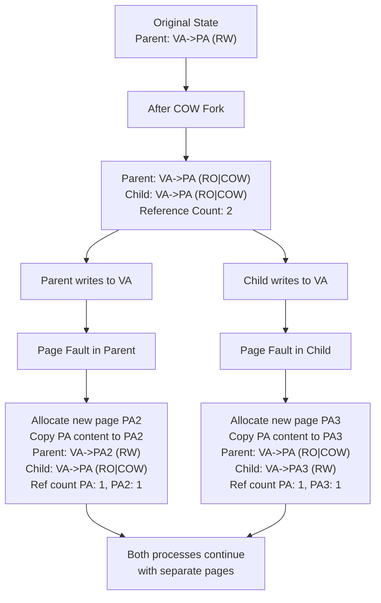

# Problem

xv6 中的 fork() 系统调用会将父进程的所有用户空间内存复制到子进程中，如果父进程很大，复制过程可能会花费很长时间。

更糟糕的是，这项工作通常是多余的：子进程 fork() 后面通常跟着 exec()，会丢弃复制的内存，通常不会使用其中的大部分。

另一方面，如果父进程和子进程都使用复制的页面，并且其中一个或两个都对其进行了写入，则复制确实是必要的。

# Analysis

实现 copy-on-write (COW) fork() 的目标是推迟 allocating 和 copying 物理内存页面，直到实际需要复制为止（如果有的话）。

COW fork() 只会为子进程创建一个页表，其中用户内存的 PTE 指向父进程的物理页面。COW fork() 将父进程和子进程中的所有用户 PTE 标记为只读。当任何一个进程尝试写入其中一个 COW 页面时，CPU 都会强制触发 page fault。内核 page fault handler 会检测到这种情况，为发生错误的进程分配 a page of physical memory，将 original page 复制到 new page 中，并修改发生错误的进程中相关的 PTE 指向 new page，此时 PTE 标记为可写。当 page fault handler 返回时，用户进程将能够写入 page。

> 这边父进程和子进程都需要将 pte 标记为只读，这样在写任意一个进程发生 page fault 时，内核都会分配一个新页，并复制原始页的内容到新页，做到进程隔离。
> 如果只标记子进程的 pte 为只读，那么如果父进程先写入，则不会触发 page fault，从而不会分配新页，而在原来的页上修改。而此时子进程的 virtual address 还指向原来的页，内容也被修改了。

正确的做法如图：



# Solution

在 uvmcopy 中，我们把父进程和子进程的的 PTE 都设置为 COW 页，清除写权限，并把父进程的物理页映射到子进程的页表中，而不是给子进程分配新的物理页：

```c++
int
uvmcopy(pagetable_t old, pagetable_t new, uint64 sz)
{
  pte_t *pte;
  uint64 pa, i;
  uint flags;

  for(i = 0; i < sz; i += PGSIZE){
    if((pte = walk(old, i, 0)) == 0)
      panic("uvmcopy: pte should exist");
    if((*pte & PTE_V) == 0)
      panic("uvmcopy: page not present");
    pa = PTE2PA(*pte);
    flags = PTE_FLAGS(*pte);

    if (flags & PTE_W)
      *pte = (*pte & ~PTE_W) | PTE_COW; /// 把父进程的写权限去掉，并设置为 COW page
    
    if(mappages(new, i, PGSIZE, pa, PTE_FLAGS(*pte)) != 0) /// 子进程的 page 也指向相同的物理地址
      goto err;
    incref(pa); /// 增加 pa 引用计数
  }
  return 0;

 err:
  uvmunmap(new, 0, i / PGSIZE, 1);
  return -1;
}
```

因为父进程和子进程的写权限都被清除了，所以在写 COW 页时会发生 page fault, 此时分配新的物理页，并复制旧页内容到新页，并修改 PTE 指向新页：

```c++
int cow_fault(pagetable_t pagetable, uint64 va) {
  uint flags;

  if (va >= MAXVA)
    return -1;

  pte_t *pte = walk(pagetable, va, 0);
  if (pte == 0)
    return -1;

  if ((*pte & PTE_V) == 0 || (*pte & PTE_COW) == 0) /// 如果不是 COW 页，对于只读页，返回错误
    return -1;
  
  flags = PTE_FLAGS(*pte);
  uint64 pa1 = PTE2PA(*pte);
  uint64 pa2 = (uint64)kalloc(); /// 分配新物理页
  if (pa2 == 0) {
    printf("cow kalloc failed\n");
    return -1;
  }
  memmove((void *)pa2, (void *)pa1, PGSIZE); /// 复制旧页内容到新页
  flags = (flags & ~PTE_COW) | PTE_W; /// 当前 page 修改为可写，并去掉 COW 标志
  kfree((void *)pa1); /// 这边减少 pa1 page 的引用计数

  if(mappages(pagetable, va, PGSIZE, pa2, flags) != 0) { /// 把 COW 页 va 映射到新的物理地址 pa2
    kfree((void *)pa2);
    return -1;
  }

  return 0;
}
```

对于每个物理页，因为可能有多个虚拟地址 (父进程和子进程) 映射到相同物理页，我们增加一个引用计数，kalloc 时，引用计数 =1，当 fork 时，引用计数 +1，当 kfree 释放物理页时，引用计数 - 1，当引用计数为 0 时，释放物理页。

创建一个 refcount 数组，包含每个 page 的引用计数。

注意在 freerange 中需要对每个 page 的引用计数设置为 1，因为 kinit 会调用 kfree 对每个 page 进行一次初始化。

```c++
int refcount[PHYSTOP / PGSIZE];

void
freerange(void *pa_start, void *pa_end)
{
  char *p;
  p = (char*)PGROUNDUP((uint64)pa_start);
  for (; p + PGSIZE <= (char *)pa_end; p += PGSIZE) {
    refcount[((uint64)p / PGSIZE)] = 1;
    kfree(p);
  }
}

void incref(uint64 pa) {
  int pn = pa / PGSIZE;
  acquire(&kmem.lock);
  if (pa >= PHYSTOP || refcount[pn] < 1)
    panic("incref");
  refcount[pn]++;
  release(&kmem.lock);
}

void
kfree(void *pa)
{
  struct run *r;
  
  //...
  acquire(&kmem.lock);
  int pn = ((uint64)pa / PGSIZE);
  if (refcount[pn] < 1)
    panic("kfree: refcount < 1");
  refcount[pn]--;
  int tmp = refcount[pn];
  release(&kmem.lock);

  if (tmp > 0)
    return;
  // ...
}

void *
kalloc(void)
{
  struct run *r;

  acquire(&kmem.lock);
  r = kmem.freelist;
  if (r) {
    kmem.freelist = r->next;
    int pn = ((uint64)r / PGSIZE);
    if (refcount[pn] != 0)
      panic("kalloc: refcount != 0");
    refcount[pn] = 1;
  }
  release(&kmem.lock);

  //...
}
```

# TODO

执行 usertests 会发生错误，还没找到原因：

```c++
$ usertests
usertests starting
test copyin: OK
test copyout: usertrap(): unexpected scause 0x0000000000000002 pid=6
            sepc=0x00000000000006f8 stval=0x0000000000000000
```
