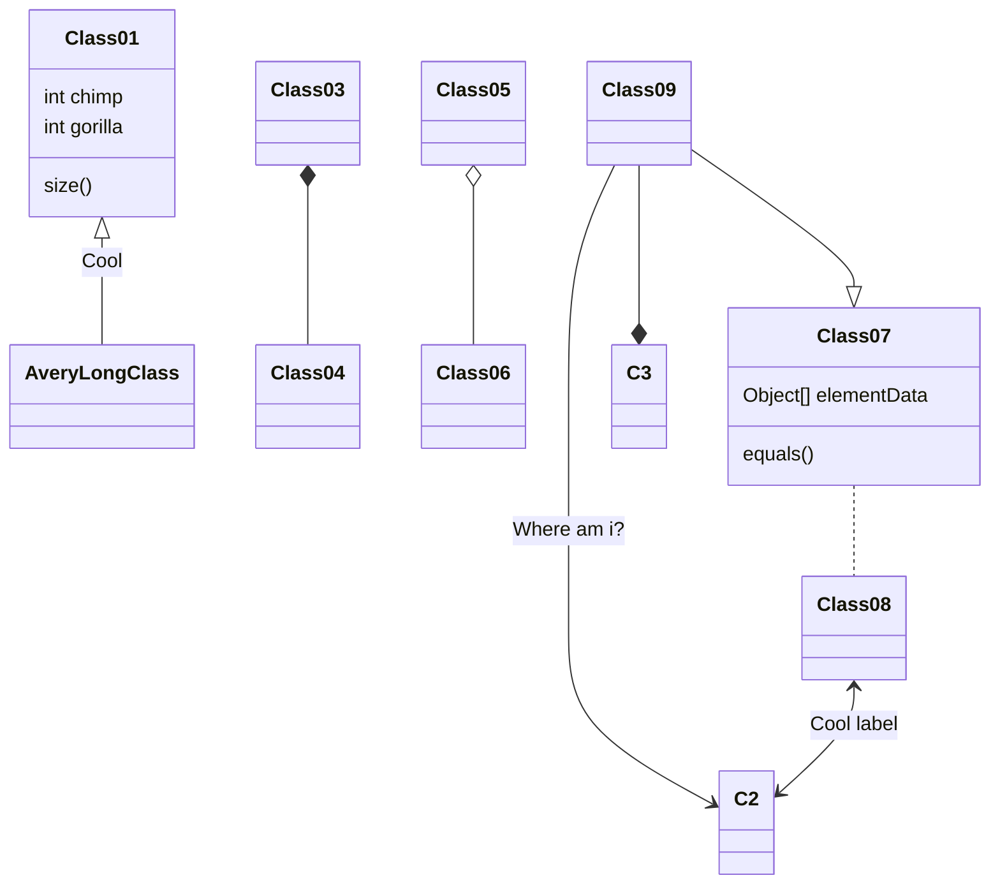

## Tags
Method 1:

Markdown


```md

success

```

Method 2:
<p class="note note-info">html</p>

```html
<p class="note note-info">html</p>
```

Support various colors:
<p class="note note-primary">primary</p>
<p class="note note-secondary">secondary</p>
<p class="note note-success">success</p>
<p class="note note-danger">danger</p>
<p class="note note-warning">warning</p>
<p class="note note-info">info</p>
<p class="note note-light">light</p>

**inline tags**:
 
 

## Blockquotes

> This is a blockquote with two paragraphs. This is first paragraph.
>
> This is second pragraph.Vestibulum enim wisi, viverra nec, fringilla in, laoreet vitae, risus.

## List

- red
- green
- blue

## Task list

Method 1：

- [ ] a task list item
- [x] completed

Method 2：



[勾选框](https://hexo.fluid-dev.com/docs/guide/#tag-%E6%8F%92%E4%BB%B6)

## Code block

```ruby
require 'redcarpet'
markdown = Redcarpet.new("Hello World!")
puts markdown.to_html
```

inline code:
`int a = 123`

## Math block

<p class="note note-warning">需要在front-matter中指定math：true</p>

$$
\mathbf{V}_1 \times \mathbf{V}_2 =
\begin{bmatrix}
\mathbf{i} & \mathbf{j} & \mathbf{k} \\
\frac{\partial X}{\partial u} &  \frac{\partial Y}{\partial u} & 0 \\
\frac{\partial X}{\partial v} &  \frac{\partial Y}{\partial v} & 0 \\
\end{bmatrix}
$$
<p class="note note-danger">矩阵没法换行，有bug，以后换个LaTeX引擎</p>

Inline math:
$\lim_{x \to \infty} \exp(-x) = 0$

## Table

| First Header | Second Header |
| ------------ | ------------- |
| Content Cell | Content Cell  |
| Content Cell | Content Cell  |

| Left-Aligned  | Center Aligned  | Right Aligned |
| :------------ | :-------------: | ------------: |
| col 3 is      | some wordy text |         $1600 |
| col 2 is      |    centered     |           $12 |
| zebra stripes |    are neat     |            $1 |

## Footnotes

这是一句话[^1]
[^1]: 这是对应的脚注

## Horizontal Rules

---

## Mermaid

<p class="note note-warning">需要在front-matter中指定mermaid：true</p>


## Links

This is [Baidu](http://www.baidu.com "Baidu") inline link.

### Internal Links

[Internal link](#Tags)

### Reference Links

看起来和Links的区别就是可以在文章其他地方定义链接

This is [Baidu][id] reference-style link.

[id]: http://www.baidu.com/  "Optional Title Here"

## URLs

直接放网址的方式：

<https://yc-xiang.github.io/>

## Images

<div align="center">

</div>

**Method 1**: html

```html
<div align="center">

</div>
```

**Method 2**: Markdown

不能改格式大小


**Method 3**: Tags 插件






## Misc

~~Mistaken text~~ <u>underline</u>
**Bold** *italic*

<!-- This is some comments -->

## Emoji

:smile:
:dog:

## html
<!-- This is some comments -->
注释：`<!-- This is some comments -->`

空行：`<br />`

## typora快捷键

- 表格：`ctrl+t`
- 选中一整行：`ctrl+l`
- 选中单词：`ctrl+d`
- 插入图片：`ctrl+shift+i`
- 插入链接：`ctrl + k`
- 代码行: ctrl + shift + \`

## Reference

[Hexo Fluid 用户手册](https://hexo.fluid-dev.com/docs/guide/)

<br />
<br />
<br />
